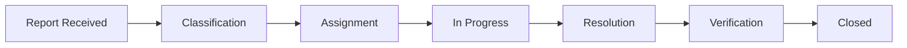
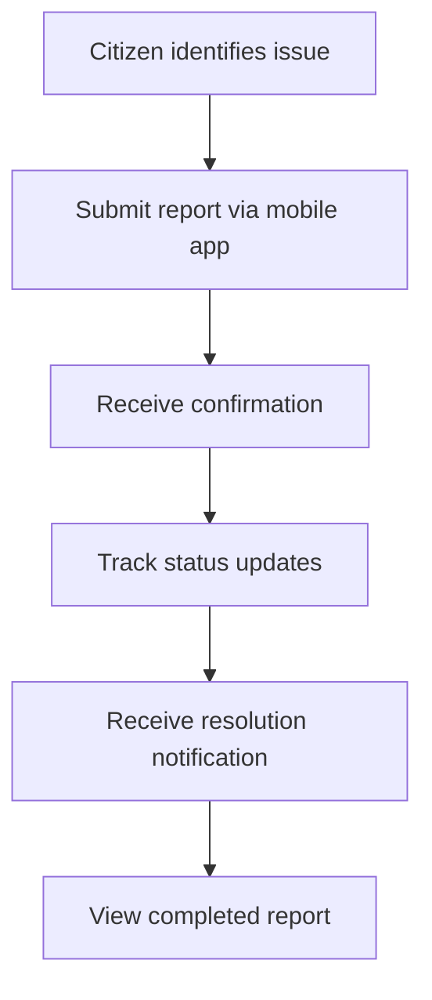

## Platform architecture

City Report operates as an integrated system with two complementary platforms, each designed for specific user needs and workflows. Together, they form a complete solution for urban issue management.

<CardGroup cols={2}>
  <Card title="Web platform" icon="desktop">
    **For municipal staff**
    
    Centralized administration and operational tracking of urban reports
  </Card>
  <Card title="Mobile platform" icon="mobile">
    **For citizens**
    
    Easy submission and real-time tracking of urban issue reports
  </Card>
</CardGroup>

## Web platform: Municipal operations

The web application serves as the command center for municipal staff, providing comprehensive tools to manage the entire lifecycle of citizen reports.

### Core capabilities

- **Centralized dashboard** - View and manage all incoming reports in one unified interface
- **Classification and categorization** - Organize reports by type, priority, location, and urgency
- **Assignment and routing** - Distribute reports to appropriate departments and personnel
- **Status management** - Track progress through defined workflow stages
- **Analytics and reporting** - Generate insights to improve decision-making and resource allocation
- **Internal communication** - Coordinate between teams working on report resolution

<Info>
  The web platform is designed for users aged 22-60, including administrative staff, operational personnel, and supervisors with decision-making responsibilities.
</Info>

### Operational workflow

The web platform enables municipal staff to move reports through each stage efficiently, maintaining clear documentation and communication throughout the process.

## Mobile platform: Citizen engagement

The mobile application empowers citizens to participate actively in improving their communities by providing a simple, transparent way to report issues and track progress.

### Core capabilities

- **Quick report submission** - Document urban issues with photos, descriptions, and location data
- **Real-time tracking** - Monitor the status of your reports from submission to resolution
- **Transparent communication** - Receive clear updates about progress and expected timelines
- **Notification system** - Get alerts when your report status changes
- **Report history** - Access your complete submission history
- **Accessible interface** - Designed for citizens aged 18-65 with basic digital literacy

<Note>
  The mobile platform promotes transparency and institutional trust by giving citizens visibility into how their reports are being handled.
</Note>

### Citizen journey

## How the platforms complement each other

The true power of City Report lies in how the web and mobile platforms work together to create a seamless communication channel between municipalities and citizens.

### Integrated information flow

1. **Citizen action** - A citizen submits a report through the mobile app
2. **Automatic routing** - The report appears instantly in the web platform's dashboard
3. **Staff processing** - Municipal personnel classify, assign, and begin work on the issue
4. **Real-time updates** - Status changes in the web platform trigger notifications in the mobile app
5. **Continuous transparency** - Citizens see progress while staff maintain operational control

<CardGroup cols={2}>
  <Card title="For citizens" icon="mobile-screen">
    **Transparency and accessibility**
    
    Fast queries, clear information, and easy tracking build trust and encourage civic participation
  </Card>
  <Card title="For municipal staff" icon="chart-line">
    **Organization and efficiency**
    
    Better classification, internal control, and operational tracking improve response times
  </Card>
</CardGroup>

## Strategic integration

City Report's dual-platform approach creates a modern model for digital civic engagement:

- **Structured communication** - Replaces informal channels with a formal, reliable system
- **Data standardization** - Ensures consistent information capture and processing
- **Traceability** - Maintains complete history from submission to resolution
- **Reduced uncertainty** - Clear statuses and timelines for all stakeholders
- **Enhanced coordination** - Improves internal municipal workflows and resource allocation

<Info>
  By eliminating information loss and establishing direct communication, City Report strengthens the relationship between government and society while improving operational efficiency.
</Info>

## System benefits

### Operational impact

- Optimized information flows enable faster response times
- Centralized data supports evidence-based decision-making
- Improved resource allocation based on issue patterns and priorities
- Enhanced internal coordination across municipal departments

### Social impact

- Increased civic participation through accessible reporting
- Stronger institutional trust through transparent processes
- Closer relationship between citizens and government
- Demonstrated municipal commitment to addressing community needs

## Next steps

Now that you understand how City Report's platforms work together, you're ready to explore platform-specific features and workflows.
