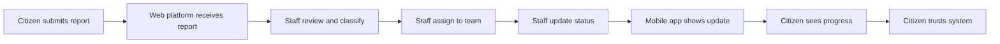

City Report operates as an integrated system where the web and mobile platforms complement each other strategically. This integration creates a complete digital model for citizen services that is modern, accessible, and controlled.

## Complementary design

The two platforms are designed to serve different users with different needs, but they work as one unified system:

<CardGroup cols={2}>
  <Card title="Web platform" icon="desktop">
    Municipal staff use the web version to centralize, organize, and manage all citizen reports with operational tools
  </Card>
  <Card title="Mobile platform" icon="mobile">
    Citizens use the mobile app to consult, track, and stay informed about their submitted reports
  </Card>
</CardGroup>

Neither platform works in isolation. The web version would be incomplete without citizens having visibility into their reports, and the mobile app would be empty without municipal staff managing the reports behind the scenes.

## How information flows

The integration between platforms creates a continuous flow of information:

### From citizens to municipality

1. A citizen submits a report through the mobile app or another channel
2. The report immediately appears in the web platform for municipal staff
3. Staff receive all relevant details: description, location, photos, priority level

### From municipality to citizens

1. Municipal staff update a report's status on the web platform
2. The status change synchronizes to the mobile app in real-time
3. Citizens see the update the next time they check their reports

<Info>
This bidirectional flow ensures both sides stay informed throughout the entire lifecycle of a report.
</Info>

## Synchronization and real-time updates

The platforms maintain synchronized data so information remains consistent and current:

### What synchronizes

- Report status changes (submitted, in review, assigned, in progress, resolved)
- Assignment of reports to specific teams or staff members
- Progress notes and updates from municipal personnel
- Resolution information and closure details

### Why real-time matters

Real-time synchronization eliminates delays that frustrate citizens and hamper municipal operations:

- Citizens don't waste time calling to check status—they see updates immediately
- Municipal staff always work with current information, not outdated data
- The system maintains a single source of truth accessible to both sides

<Note>
Every action taken on one platform reflects on the other, creating transparency and accountability throughout the process.
</Note>

## Creating a complete communication loop

The integration establishes a formal, structured communication channel between citizens and their municipality:

This loop addresses common problems with informal reporting systems:

- **Lost information** - Nothing falls through the cracks when everything is tracked digitally
- **Lack of follow-up** - Citizens know what's happening at every stage
- **Negative perceptions** - Transparency builds trust in municipal services
- **Inefficient operations** - Staff coordinate better with centralized information

## Eliminating intermediaries

One of the most important benefits of platform integration is the removal of unnecessary middlemen:

### Before City Report

- Citizens call municipal offices and speak to whoever answers
- Information passes through multiple people before reaching the right team
- Details get lost or distorted in translation
- Citizens must call repeatedly to check status

### With City Report

- Citizens submit reports directly into the system
- Reports route automatically to appropriate staff
- All information remains intact and accessible
- Citizens track status independently through the app

This direct channel reduces friction, saves time, and improves accuracy on both sides.

## Benefits for municipal operations

The integrated system improves how municipalities function:

### Standardized processes

You establish consistent workflows for handling reports rather than relying on informal methods that vary by person or department.

### Clear traceability

Every report has a complete history showing who handled it, what actions were taken, and when status changed. This accountability helps identify bottlenecks and improve performance.

### Efficient resource allocation

When you see all reports in one system, you can identify patterns, prioritize effectively, and deploy resources where they're needed most.

<Info>
Municipalities using City Report can make data-driven decisions about urban management rather than relying on anecdotal information.
</Info>

## Benefits for citizens

The integration delivers tangible improvements to citizen experience:

### Transparency

You see exactly what's happening with your reports instead of wondering whether anyone is paying attention.

### Accessibility

You access information anytime from your mobile device rather than during limited office hours.

### Participation

You engage more actively in civic matters when you see that your involvement leads to real outcomes.

### Trust

You develop confidence in municipal services when you experience responsive, organized communication.

## A unified solution

While City Report consists of two separate platforms, it functions as one integrated solution. The web and mobile versions are:

- **Strategically complementary** - Each serves its specific users while supporting the other
- **Operationally synchronized** - Information flows seamlessly between platforms
- **Functionally unified** - Together they create a complete system for managing citizen-municipality communication

<Note>
This integrated approach consolidates a modern digital model for citizen services that strengthens the relationship between government and community.
</Note>

## Impact on communication

The platform integration fundamentally improves how municipalities and citizens communicate:

- Establishes a formal, reliable digital channel replacing informal methods
- Provides structure and standards for information exchange
- Ensures transparency through shared visibility into report status
- Increases efficiency by streamlining workflows and eliminating delays
- Builds closer, more trustworthy relationships between citizens and government

By working together as an integrated system, the web and mobile platforms of City Report deliver benefits that neither could provide alone.